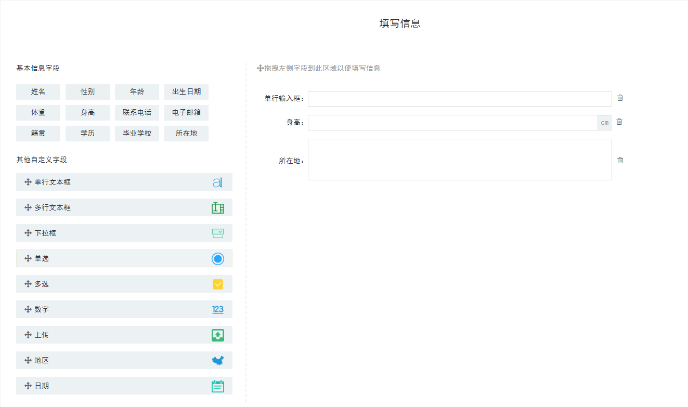

## 一、介绍

这是一个简单的小DEMO，实现的功能是拖拽左侧的表单项生成表单，可以删除表单，可以对表单进行排序，缺少的表单的编辑将在后续完善。

## 二、资源

字体图标库：font-awesome-4.7.0

地区联动插件： v1.0.4 https://github.com/fengyuanchen/distpicker

jquery-ui库：v1.12.1 http://jqueryui.com

layui：v2.4.5 https://www.layui.com

## 三、互动

github：<a href="https://github.com/zerozrn">https://github.com/zerozrn</a>

CSDN：<a href="https://blog.csdn.net/zrn1812083198">https://blog.csdn.net/zrn1812083198</a>
